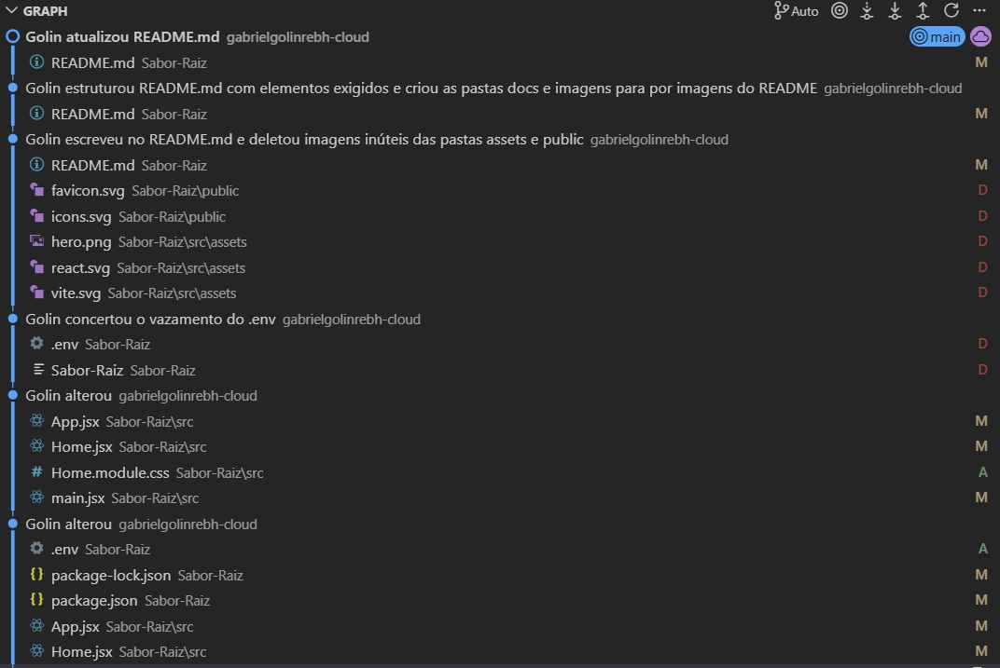

# Sabor Raiz (Website de Empresa de Confeção de Presentes)

## Sobre a Empresa
Acelera o processo de encomenda personalizada e venda de produtos relacioandos a presentes.

## Sobre a Arquitetura
`estruturação em andamento...`

## Integrantes do Grupo
* Brenon Gustavo Fossa
* Gabriel Golin
* Flávia Caroline Sentena
* Kauã Kousen

## Recursos Utilizados
* JavaScript (.js)
* React (.jsx)
* CSS (.module.CSS)
* MySQL (sql)
* GitHub (repositório)

## Repositório do Projeto (GitHub)
1. git clone https://github.com/gabrielgolinrebh-cloud/Sabor-Raiz

## Entidades
* **Cliente:** Nome, Email, CPF, Senha, Telefone, Endereço.
* **Produto:** Nome, Preço, Descrição, Estoque, Categoria.
* **Pedido:** ID Pedido, Cliente (ID Pedido), Data, Status, Valor Total.

## Endpoints
* **Clientes:**
    * `POST /clientes` - Cadastrar novo cliente.
    * `GET /clientes` - Listar todos clientes.
* **Produtos:**
    * `GET /produtos` - Listar todos produtos disponíveis.
    * `POST /produtos` - Adicionar novo produto (exclusivamente Admins).
* **Pedidos:**
    * `POST /pedidos` - Criar novo pedido.

## Imagens
   